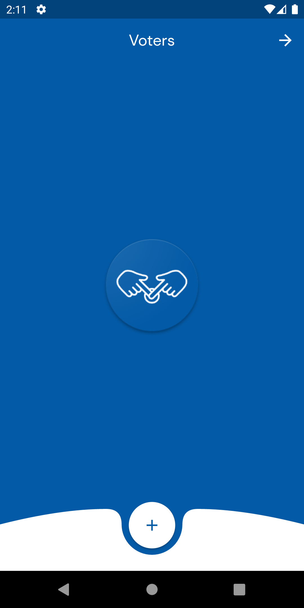
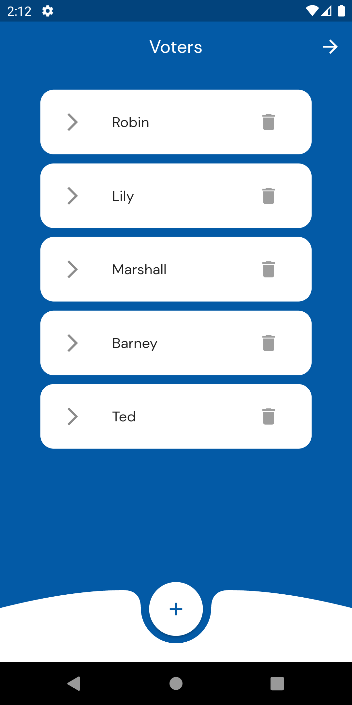
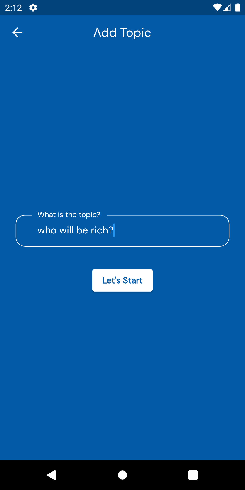
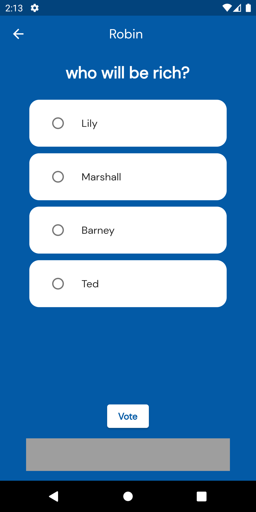
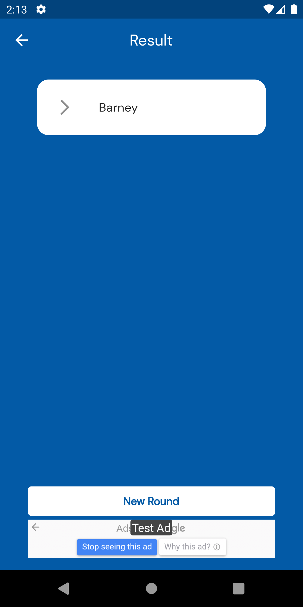

# Vote Time!

It's time to vote all the questions in your mind with your friends. Just add the question and give the phone to your friend :)

## Download:

<ul><li>

</li></ul>
<ul><li>

<a href="https://play.google.com/store/apps/details?id=com.ibrakaya.vote_time" >Download for Android </a>

</li></ul>

## Features:

This project has several features:

- Stateless and stateful widgets.
- State management with provider.
- Add/Edit/Delete options.
- Google Ads (Banner/Interstitial)
- Custom design

## Preview:

<table><tr>
<td style="text-align: center">

</td>
<td style="text-align: center">

</td>
<td style="text-align: center">

</td>
</tr></table>

<table><tr>
<td style="text-align: center">

</td>
<td style="text-align: center">

</td>

</tr></table>

